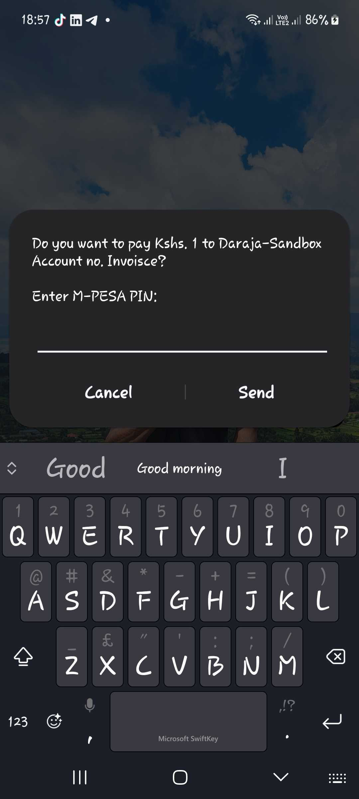

### DJANGO DARAJA

This is a small reusable application built using Django to assist developers who want to collect payments using Safaricom's developer platform, [daraja.](https://developer.safaricom.co.ke/)

The initial implementation is for the STK push functionality which ideally should allow developers to send payment request to the customer's mobile phone where the customer only needs to enter their MPESA PIN.

An STK push alert looks like:



#### HOW TO INSTALL

To install this app, copy the following and paste into an active virtual environment:

`pip install https://github.com/nicksonlangat/django_daraja_interface/releases/download/v01/django-daraja-0.1.tar.gz`

Then add, to your `settings.py`, under `INSTALLED_APPS`:

```python
 "django_daraja.apps.DarajaConfig"
```
Next, you need to supply a few variables into your projects `settings.py`:

```python
MPESA_PASS_KEY = ""
CONSUMER_KEY = ""
CONSUMER_SECRET = ""
SHORTCODE = ""
BUSINESS_SHORT_CODE = ""
```
You can find all the above information from your developer account at [this link.](https://developer.safaricom.co.ke/)

After supplying the credentials above, you can go ahead and create a view to send and process STK requests.

Below is an example way of achieving this:

```python
from rest_framework.response import Response
from rest_framework.views import APIView
from django_daraja import utils
from rest_framework import status

from rest_framework import serializers

class InpuSerializer(serializers.Serializer):
        phone_number = serializers.CharField(required=True)
        amount = serializers.CharField(required=True)

class STKPushApi(APIView):
    serializer_class = InpuSerializer

    def post(self, request, format=None):
        serializer = self.serializer_class(data=request.data)
        serializer.is_valid(raise_exception=True)
        daraja = utils.MpesaDarajaHandler(
             "https://sandbox.safaricom.co.ke/oauth/v1/generate?grant_type=client_credentials",
             "https://sandbox.safaricom.co.ke/mpesa/stkpush/v1/processrequest",
        )

        result = daraja.lipa_na_mpesa_online(
             serializer.validated_data["phone_number"],
             serializer.validated_data["amount"],
             "Mama mboga",
             "Payment for grocery",
             "https://yourdomain.com/callback",
             )
        return Response({"result": result}, status=status.HTTP_200_OK)
```
Hook that view to a `urls.py` file:
```python
from django.urls import path
from . import views

urlpatterns = [
    path("send-stk", views.STKPushApi.as_view(), name="send-stk"),
]

```
Now you can visit the endpoint, enter the phone number and the amount to charge and the phone number's owner should receive an STK push prompting them to enter their PIN to authorise the transaction.


